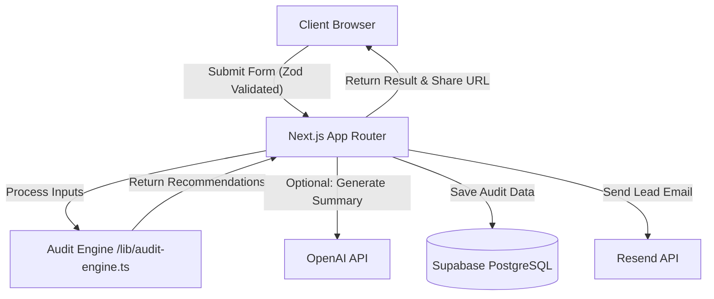

# Architecture

## Overview
AI Spend Audit is built on Next.js App Router (v15) leveraging React 19. The application architecture is designed for speed, deterministic output, and graceful degradation when external services (Supabase, OpenAI, Resend) are unavailable.

## System Diagram

## Data Flow: Input to Audit Result

1. **User Input:** The user fills out the audit form on the client (React Hook Form + Zod for validation).
2. **Submission:** Data is submitted to a Next.js Server Action or API route.
3. **Validation & Rate Limiting:** The server re-validates the input using Zod and applies basic rate limiting based on IP to prevent abuse.
4. **Audit Processing:** The valid payload is passed to the `lib/audit-engine.ts`. The engine deterministically calculates total spend, cross-references tool pricing rules (e.g., checking if Copilot and Cursor are used redundantly), and generates right-sizing recommendations.
5. **AI Summarization:** If an OpenAI key is configured, a background task generates a concise, personalized narrative of the savings using a lightweight LLM call. If not, a template string is used.
6. **Persistence:** The calculated result and the original inputs are stored in Supabase PostgreSQL, yielding a unique `shareId`.
7. **Delivery:** The server sends an email via Resend to the provided address and returns the results to the client, redirecting the user to `/report/[shareId]`.

## Why This Stack

- **Next.js 15 (App Router) & React 19:** Enables rapid iteration, full-stack type safety with TypeScript, and great performance using Server Components.
- **Tailwind CSS & Radix UI:** Provides highly customizable, accessible, and fast-to-develop UI components.
- **Supabase:** Offers out-of-the-box PostgreSQL, great developer experience, and simple integrations without the overhead of manually managing a database.
- **Zod:** Guarantees input correctness on both the client and the server, reducing the likelihood of runtime errors in the audit engine.
- **OpenAI & Resend:** Standard, reliable APIs for natural language generation and transactional emails that are simple to implement.

## Scaling to 10,000 Audits / Day

If this application had to handle 10k audits per day reliably, we would change the following:

1. **Asynchronous Background Processing:** Move the OpenAI generation and Resend email tasks to a message queue (like Inngest, Upstash QStash, or AWS SQS). Currently, the user might wait for these APIs to resolve during the request lifecycle.
2. **Caching Layer:** Introduce Redis (e.g., Upstash Redis) to cache the pricing rules, rate limits, and potentially frequently accessed public reports to reduce database load.
3. **Database Connection Pooling & Indexing:** Ensure Supabase/PostgreSQL uses connection pooling (PgBouncer) properly and that indices exist on the `shareId` and `email` columns for fast lookups.
4. **Authentication and User Accounts:** Move beyond a simple email capture to proper user accounts (e.g., Supabase Auth or Clerk), allowing teams to update their stack over time without starting from scratch.
5. **Monitoring & Analytics:** Implement robust error tracking (Sentry) and observability (Datadog or OpenTelemetry) to trace slow OpenAI calls or failed email deliveries at scale.
